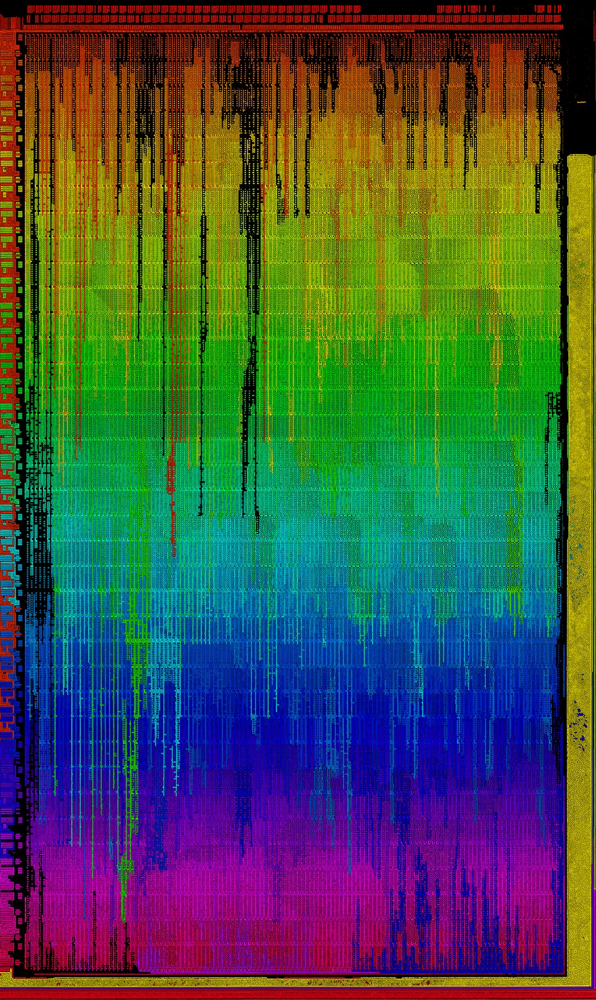

This image was inadvertently created during early attempts at automated bit extraction.  I had the idea to use OpenCV to perform an adaptive threshold on the microcode photo-mosaic, then segment the thresholded image into connected regions. 

Each region was mapped to a different color. I guess the idea was to try to extract the contours of the polysilicon. Unfortunately there are too many "leaks" regardless of what thresholding values you attempt to use, thus the effect of color spilling downwards, like dripping paint.

This has no educational value whatsoever, I just think it looks cool.

- GloriousCow
