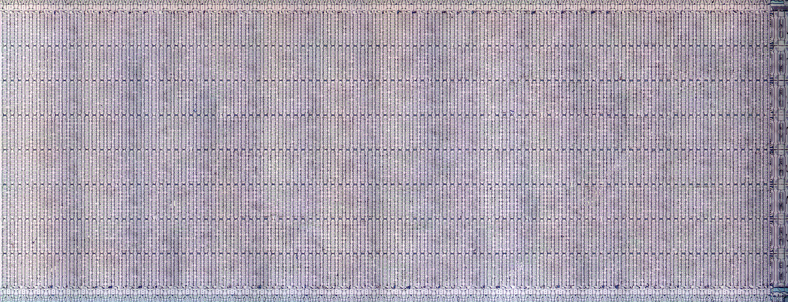
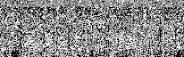

# The Intel 8087 Microcode

Extraction of the 8087 Microcode was made possible by die photography performed by [Ken Shirriff](https://righto.com). 

See [Ken's excellent article analyzing the 8087 Microcode ROM](https://www.righto.com/2018/09/two-bits-per-transistor-high-density.html).

This ROM is unique in that it is quad-level - rather than storing 0's and 1's directly, three sizes of transistor 
(along with no transistor) provide four logic levels which can be decoded into pairs of two bits.

This presents a challenge for traditional ROM extraction tools, so a CNN was employed to extract the bit positions.

I'm looking for help verifying the correctness of the ROM extraction due to the ambiguity of small and medium transistors.
You can view the full microcode ROM image and report issues using the [8087 microcode web viewer](https://8087.martypc.net).

## 8087_microcode_rom_01.txt

The extracted literal content of the 8087 microcode ROM. 

 - 0: No transistor
 - 1: Small transistor
 - 2: Medium transistor
 - 3: Large transistor

## /images/8087_microcode_rom_01.png

A graphical representation of the 8087 microcode ROM as an 2bpp indexed color PNG.

Word extraction has not yet been performed. It will be tricky as the 8:1 row multiplexing logic is inverted every 8 rows 
and the exact 8087 word format is unknown.

## /images/upper-decoder.jpg

A die photo by Ken Shirriff of the upper microcode decoder circuitry.

## /images/lower-decoder.jpg

A die photo by Ken Shirriff of the lower microcode decoder circuitry.
