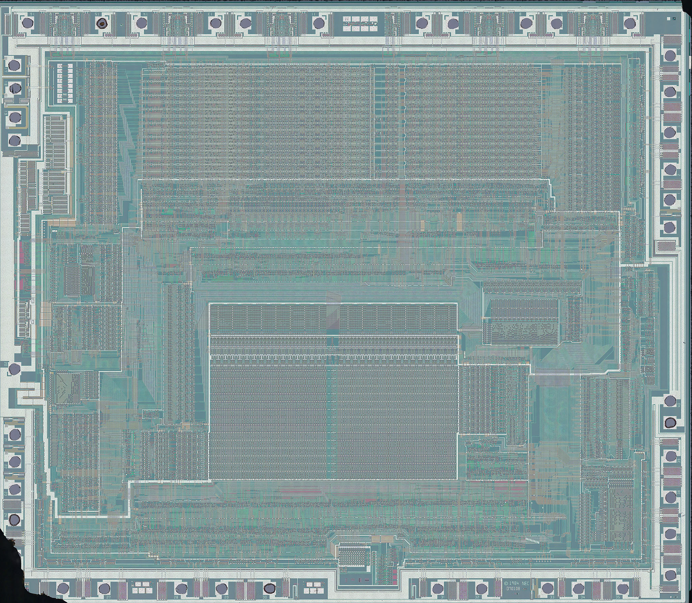
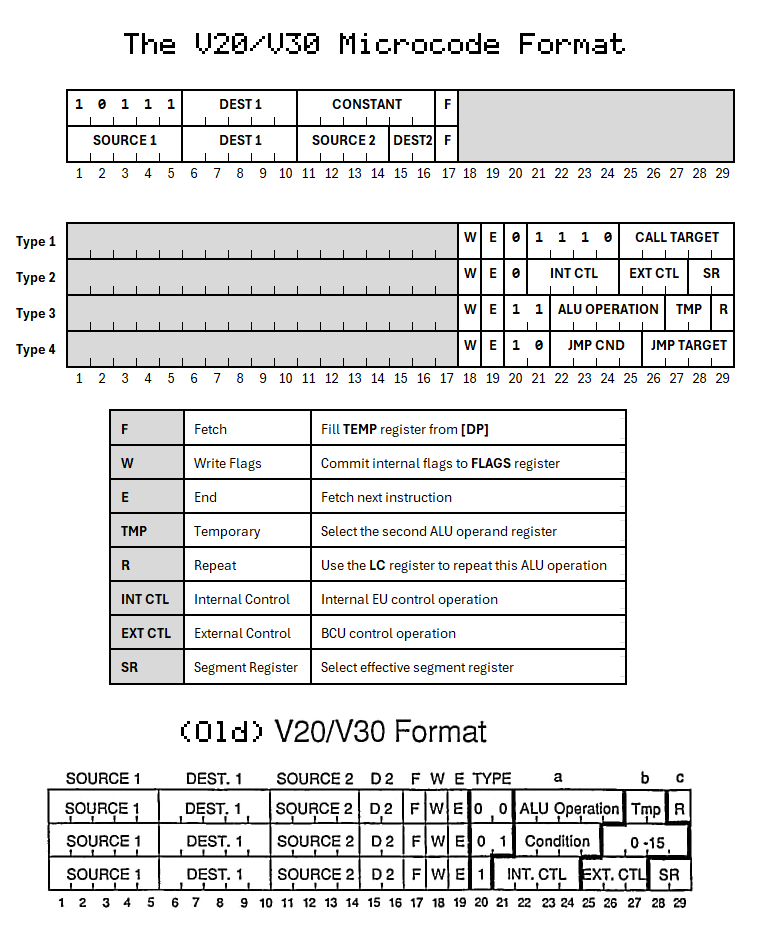
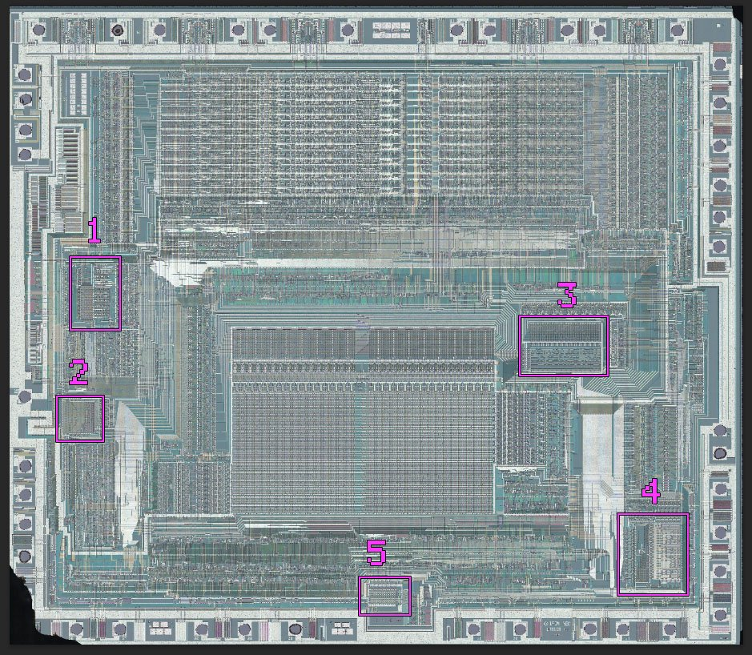

# The NEC V20 & V30 Microcode

A decoding of the NEC V20/V30 microcode was recently made possible via the imaging work of [InfoSecDJ](https://infosec.exchange/@infosecdj):

NEC used unified microcode for both the NEC V20 and V30, which differ only in their metal layer interconnects.

The only difference between the microcode for either version of CPU is in the microcode routine that handles hardware
interrupts. Like the 8088, the V20 needs a special routine to only issue one INTA request to the 8259 as otherwise its
BIU logic will split two INTA cycles into four. 

## Word Format

There are some differences between the actual microcode word format the published legend, which has its origin in 
court documents from the NEC vs Intel lawsuit. The microcode is logically split into two parts, 17 bits that encode
source and destination operands, and 12 bits that encode executive instructions.

The source/destination field has two formats, one that encodes two source/destination pairs, and one that encodes an
immediate constant value. 

## Files

#### v20_microcode.xlsx

The current working decode spreadsheet of the V20 microcode. Some field values are still undetermined.

#### v20_microcode_01.txt

The extracted bits from the V20's microcode ROM in ASCII format, an array of 258x116 bits. 

Note that there are two more columns than you may expect. Column 128 (exactly halfway through the ROM) does not appear
to be decoded. Columns 118 & 119 contain the hardware interrupt routine for the V20 and V30, respectively. The column
not used by the specific CPU is disabled.

These bits are also available as a PNG and PBM image, as follows:

#### /images/microcode_rom.png
#### /images/microcode_rom.pbm

#### /images/microcode_crop_01.jpg

This is a half-resolution crop of the microcode ROM region. This image file was used with MaskRomTool to define the ROM
bit positions.

#### /images/microcode_crop_01.jpg.json

MaskRomTool's saved project file for the image above. If you load the image with this JSON in the same directory in
MaskRomTool the project should be restored and you could attempt your own extraction.

#### /images/microcode_bit_check.jpg

This is a grid-aligned image of the microcode ROM bits showing the logical bit extraction overlayed - a 1 bit being a 
bright square and a 0 being a dark square.  This image was used for manual verification of the extraction accuracy.

Spot any errors? Please open an issue if you do!

#### /images/activation_pla_01.jpg

This is a half-resolution crop of the microcode activation PLA, or what Intel calls a matching decoder PLA. 

#### /images/activation_pla_01.jpg.json

MaskRomTool's saved project file for the image above. If you load the image with this JSON in the same directory in
MaskRomTool the project should be restored and you could attempt your own extraction.

### v20_activation_pla.txt

The extracted gates from the V20's microcode activation PLA in ASCII format, an array of 257x26 bits. 
The PLA encodes logic, not just bits - the way to interpret this image is as pairs of two pixels, vertically, that 
encode the following logic.

|   |   | Meaning    |
|---|---|------------|
| 0 | 0 | Don't Care |
| 1 | 0 | Match 1    |
| 0 | 1 | Match 0    |
| 1 | 1 | Impossible |

Lines 

The extracted bits from the activation PLA are also encoded as two image files, as specfied below.

#### /images/activation_pla_01.png
#### /images/activation_pla_01.pbm

### /scripts/bit_classifier.py 

A python script that uses the PyTorch framework to either train or run a convolutional neural network (CNN) to classify
input images as either 1's or 0's. The CNN trained by this script was used to extract the bits from the die photos.

The versions of pytorch used with this script were:
|  package   |   version   |
|------------|-------------|
|Python      |       3.10.5|
|torch       |  2.8.0+cu126|
|torchvision | 0.23.0+cu126|

### /models/microcode/model.pt

The trained PyTorch model used to extract the microcode bits. It was trained on an input size of 42x42.

### /models/activation_pla/model.pt

The trained PyTorch model used to extract the activation PLA bits. It was trained on an input size of 64x64.

### /scripts/extract_bits.py

This script takes the JSON file output by MaskRomTool and extracts square PNG files representing the area around each
indicated bit position, and will save the resulting images into a ZIP file to avoid thrashing your filesystem.

The resulting ZIP can be fed to the model via bit_classifier.py to reproduce the classification process, if you wish.

## Additional PLAS

Zoomed in views of the indicated PLAs:

### /images/pla_1.jpg
### /images/pla_2.jpg
### /images/pla_3.jpg
### /images/pla_4.jpg
### /images/pla_5.jpg

### /v20_pla3.txt

The decoded PLA3 which is the V20's equivalent of the 8088's "Group Decode ROM".

The first two bits are a sort of opcode type field -

| bits | meaning                  |
|------|--------------------------|
| 00   | 8080 instruction         |
| 01   | normal instruction       |
| 10   | not present              |
| 11   | extended NEC instruction |

The next 9 bits are provisionally identified as follows:

| bit | meaning |
|-----|---------|
| 0 | force byte operand |
| 1 | W bit is valid |
| 2 | one-byte non-microcoded instruction or prefix |
| 3 | uses AX or AL register |
| 4 | segment register operand |
| 5 | has modrm - this appears to only be valid for the 8088/80186 instructions |
| 6 | doesn't read EA operand |
| 7 | D bit is valid |
| 8 | set for all opcodes > 7F |

The final five bits appear to identify individual instructions within their class. 
For non-microcoded instructions there are exactly 16 variants:

|bits| meaning|
|----|--------|
| 0000 | Segment override |
| 0001 | 0F |
| 0010 | STD |
| 0011 | CLD |
| 0100 | STI / EI |
| 0101 | CLI / DI |
| 0110 | STC |
| 0111 | CLC |
| 1000 | REPC |
| 1001 | REPNC |
| 1010 | CMC |
| 1011 | HLT |
| 1100 | REPZ |
| 1101 | REPNZ |
| 1110 | F1 LOCK ALIAS(?) |
| 1111 | LOCK |